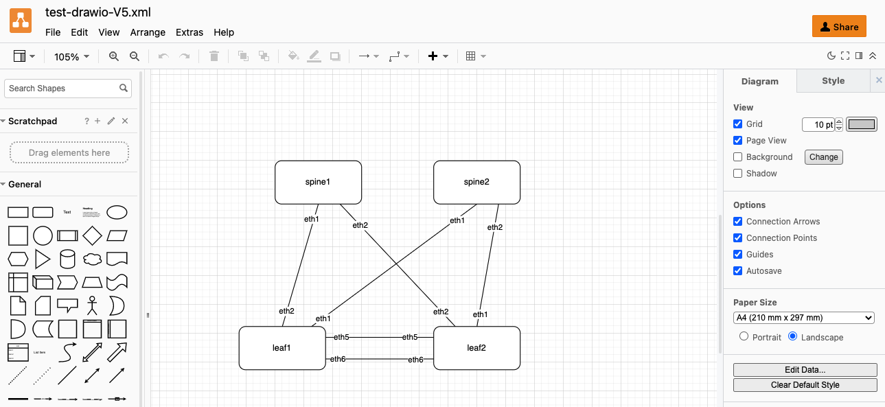

# drawio-to-containerlab

Python script to build a [containerlab](https://containerlab.dev/) topology from a [draw.io](https://app.diagrams.net/) diagram.




## Quickstart

```bash
# Install package
pip install -e .

# Run conversion
drawio-to-containerlab -i test-drawio-V5.xml -o demo.yml

# Result
cat demo.yml

name: DRAWIO_LAB
topology:
  kinds:
    ceos:
      image: arista/ceos:4.28.3M
  nodes:
spine1:
        kind: ceos
spine2:
        kind: ceos
leaf1:
        kind: ceos
leaf2:
        kind: ceos

  links:
- endpoints: ['spine1:eth1', 'leaf1:eth2']
- endpoints: ['spine1:eth2', 'leaf2:eth2']
- endpoints: ['spine2:eth1', 'leaf1:eth1']
- endpoints: ['spine2:eth2', 'leaf2:eth1']
- endpoints: ['leaf1:eth5', 'leaf2:eth5']
- endpoints: ['leaf1:eth6', 'leaf2:eth6']
```

## Licence

Code under [Apache 2](LICENSE) License

## Author

[@dwarf](https://github.com/dwarf-fr/)